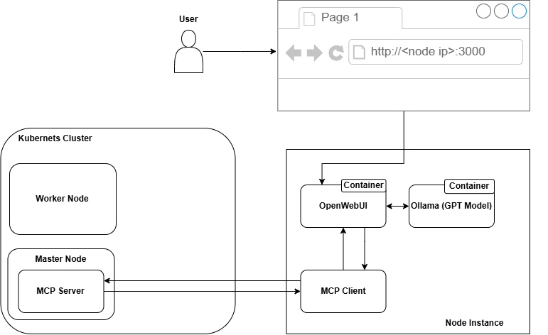
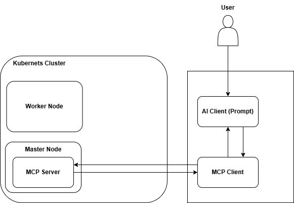

# simple-tools-security-scanner-kubernetes
Simple tools based on MCP architecture using Hexstrike AI as a base code.

## Schema Architecture Option
### Option 1

### Option 2

## Component

## How To Install
### MCP Client
### MCP Server
