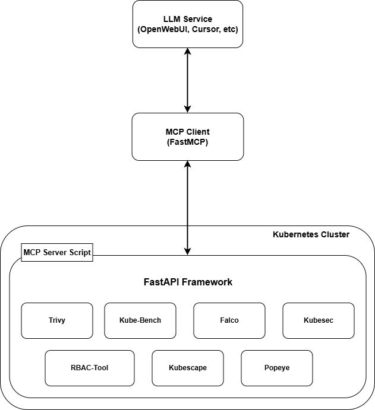
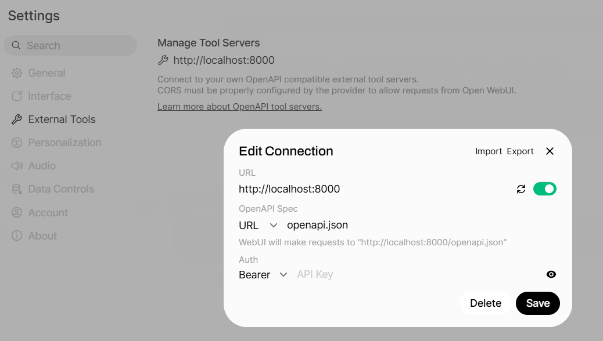
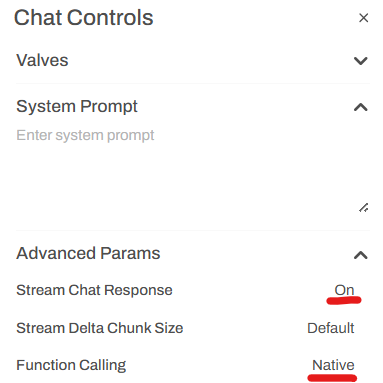
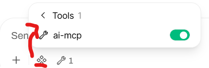
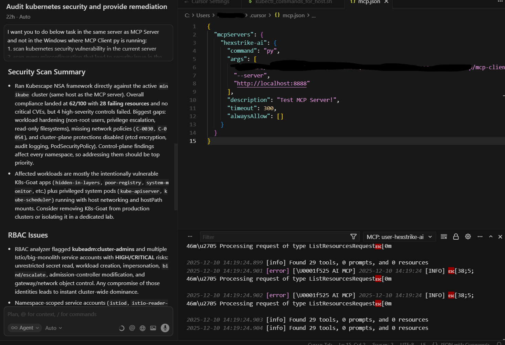

# Simple-Tools-Security-Scanner-Kubernetes
Simple tools based on MCP architecture using Hexstrike AI as a base code. This PoC demonstrates a privacy-preserving Kubernetes security scanner that integrates multiple open-source security tools via an MCP Server and processes results using a locally hosted LLM or using LLM service like Cursor, Claude, etc.

## Objectives & Success Criteria
### Objectives
- [X] Scan Local Kubernetes cluster security posture
- [X] Detect misconfiguration, RBAC risk, and benchmark violations
- [X] Normalize results using CIS / NSA benchmarks
- [X] Present human-readable output via LLM

### Success Criteria
| Criteria           | Success Indicator        |
|--------------------|--------------------------|
| Coverage           | Used >= 5 tools executed |
| Accuracy           | Results align with the actual existed vulnerability with less than 30% false positive result |
| Usability          | Human-readable summary generated and easiest instruction from LLM Prompt |
| Extensibility      | Able to add New tools via MCP |

### In-Scope and Out-of-Scope
| In-Scope           | Out-of-Scope             |
|--------------------|--------------------------|
| Local Kubernetes cluster | Cloud managed Kubernetes cluster (GKE, EKS, AKS) |
| Linux based scanner | Windows based scanner   |
| Manifest and RBAC analysis |                  |

## Tools Architecture


## MCP Server Endpoint Route
| Route                           | HTTP Method | Description                                   |
|---------------------------------|-------------|-----------------------------------------------|
| /health                         | GET         | Check available tools in server               |
| /api/command                    | POST        | Execute shell command in server               |
| /api/files/list                 | GET         | Listing any file in a folder                  |
| /api/cache/stats                | GET         | Get statistics of this tool's cache           |
| /api/cache/clear                | POST        | Clear any existed cache                       |
| /api/telemetry                  | GET         | Get information like how many execute command, successfull command, failed command, total execution time, start time, and many more |
| /api/processes/list             | GET         | List any processes in server                  |
| /api/processes/status/<int:pid> | GET         | Get specific information of process using PID |
| /api/processes/terminate/<int:pid> | POST     | Terminate processes using PID                 |
| /api/processes/pause/<int:pid>  | POST        | Pause a running processes using PID           |
| /api/processes/resume/<int:pid> | POST        | Resuming any processes using PID              |
| /api/processes/dashboard        | GET         | Displaying any live processes with more enhance display          |
| /api/visual/vulnerability-card  | POST        | Create card that will storing information about severity of found vulnerabilites |
| /api/visual/summary-report      | POST        | Create summary report of the scanning result  |
| /api/visual/tool-output         | POST        | Create formatted output for any result of the tools |
| /api/vuln-intel/cve-monitor     | POST        | Get information of the newest CVE from NIST   |
| /api/intelligence/analyze-target| POST        | Analyze target to get type of the target (Cloud, Web, etc) |
| /api/intelligence/select-tools  | POST        | Select right tools for the context that processed |
| /api/error-handling/statistics  | GET         | Get statistic of the error that happened in server |
| /api/tools/scan/trivy           | POST        | Scan container image or filesystem with Trivy |
| /api/tools/audit/kube-bench     | POST        | Security auditing for Kubernetes Cluster resource using CIS Benchmark |
| /api/tools/monitoring/falco     | POST        | Get live runtime activity that suspicious in Kubernetes Cluster |
| /api/tools/scan/kubescape       | POST        | Scan Security of Kubernetes Cluster using Kubescape with default benchmarking using NSA standarization |
| /api/tools/audit/popeye         | POST        | Auditing Kubernetes Cluster resource and report potential security issues using Popeye |
| /api/tools/scan/rbac-tool       | POST        | Scan Kubernetes manifest to detect any security issue in the RBAC configuration |
| /api/tools/scan/kubesec         | POST        | Scan Kubernetes Cluster manifest using Kubesec | 

## Architecture Option
### Option 1


### Option 2


## Installation
### MCP Client in Architecture Option 1

1. First, you need to make sure that Docker is already installed in your node.

2. We need to generate new secret key for open-webui using below command.

```bash
openssl rand -hex 32
```

3. Than, we need to deploy `open-webui` and `ollama` container using below docker compose file. Also, don't forget to add open-webui secret key from previous step.

```bash
services:
  ollama:
    image: ollama/ollama:latest
    ports:
      - 11434:11434
    volumes:
      - ollama:/root/.ollama
    container_name: ollama
    tty: true
    restart: unless-stopped

  open-webui:
    image: ghcr.io/open-webui/open-webui:main
    container_name: open-webui
    volumes:
      - open-webui:/app/backend/data
    depends_on:
      - ollama
    ports:
      - 3000:8080
    environment:
      - 'OLLAMA_BASE_URL=http://ollama:11434'
      - 'WEBUI_SECRET_KEY=your_secret_key'
    extra_hosts:
      - host.docker.internal:host-gateway
    restart: unless-stopped

volumes:
  ollama: {}
  open-webui: {}
```

3. Deploy `ollama` and `open-webui`
```bash
docker compose up -d
```

4. Downloading `gpt model` in `ollama`

```bash
docker exec -it ollama sh
ollama pull gpt-oss:20b
```

5. Ensure that gpt model has been able to use in `open-webui`

6. Back to the node and install `mcpo` to providing proxy for MCP Access on Open-WebUI alongside with other additional dependencies that defined in file `extra-dependencies-client-option2.txt`.

```bash
pip3 install -r extra-dependencies-client-option2.txt
```

7. Run `mcpo` (in my case, I'm using port 8000) and also pointing it into existing `mcp client` script with `mcp server endpoint url`.

```bash
mcpo --host 0.0.0.0 --port 8000 -- python3 mcp-client.py --server "http://<server-node-ip>:8888"
```

8. Check if the MCP Client has been able to use by accessing `openapi.json`. If it reply with json reply that listing every tools than it is success, if not it is failed.

```bash
curl localhost:8000/openapi.json
```

9. Back to the `open-webui` and add MCP tools via "external tools" menu. Also, make sure that connection test run successfully.



10. Than, to model AI be able interact with AI MCP, we need to turn on "Stream response" and Set Function Calling to "Native"



11. Lastly, you need to enable "AI MCP" tools in the prompt and test it by giving a prompt text to do.



### MCP Client in Architecture Option 2

1. First, you need to already has registered account and able to use LLM services like Cursor or anything else. Here, I'm using Cursor to make it simply just by register and install it in my local.

2. Add MCP Client json configuration that I already add in file "mcp-client.json" into the MCP Client configuration in each LLM services.

3. Make sure that the connection between LLM service and MCP Client run well, than you already to use the MCP.

### MCP Server
```bash
# Clone the repository
git clone https://github.com/aldialvayadi2/simple-tools-security-scanner-kubernetes.git

cd simple-tools-security-scanner-kubernetes

# Create virtual environment
python3 -m venv my-venv
source my-venv/bin/activate

# Installing required Python dependencies
pip3 install -r requirements-mcp-server.txt
```

## Example Result

NB: Here using Cursor

